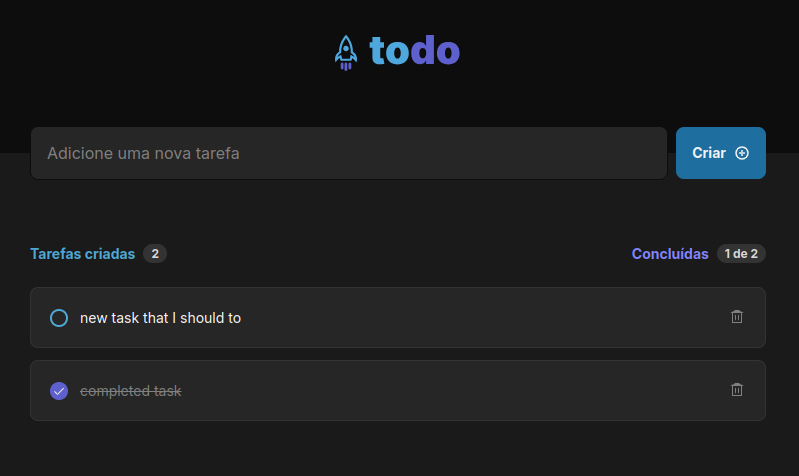

# ignite-react-01-conceitos

A simple and intuitite To-do list application, built with TS/React as part of Rocketseat's Ignite bootcamp.



## Features

- Add new tasks
- Toggle task completion status
- Remove tasks
- Add tasks by pressing the Enter key
- Show tasks completion status

## Getting started

Make sure you have the following installed:

- [Node.js](https://nodejs.org/) (v14 or higher)
- [npm](https://www.npmjs.com/) (v6 or higher) or [yarn](https://yarnpkg.com/)

### Installation

1. Clone the repository:

```bash
   git clone https://github.com/fpsaraiva/ignite-react-01-conceitos.git
   cd todo-app
```

2. Install the dependencies:

   ```bash
   npm install
   # or
   yarn install
   ```

3. Running the App

To start the development server, run:

```
npm run dev
```

### Usage

1. Enter a task in the input field.
2. Click the "Criar" button or press the Enter key to add the task.
3. Click the checkbox next to a task to toggle its completion status.
4. Click the trash icon next to a task to remove it.

## Contributing

Contributions are welcome! Please open an issue or submit a pull request for any changes.

## License

This project is licensed under the MIT License. See the LICENSE file for details.
